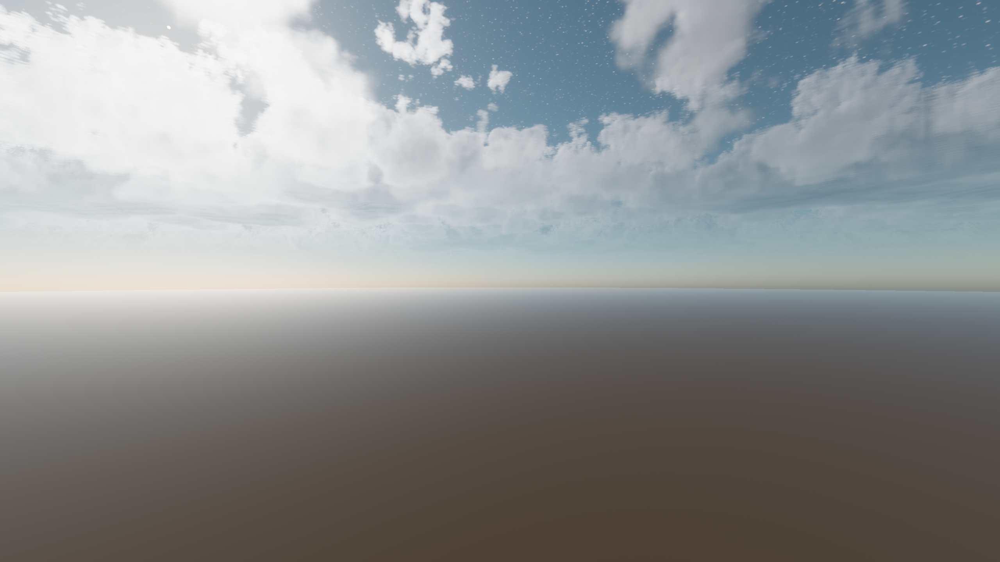
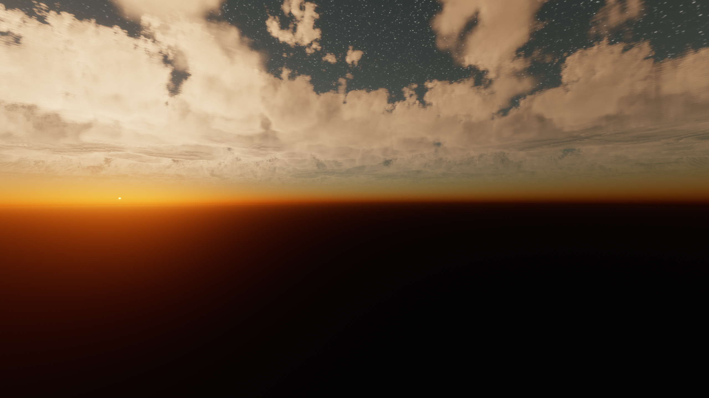

# Nishita Sky With Volumetric Clouds

This is a Nishita sky shader for godot 4.0, with [Clay John's volumetric clouds](https://github.com/clayjohn/godot-volumetric-cloud-demo) based on [a tutorial by scratch pixel](https://www.scratchapixel.com/lessons/procedural-generation-virtual-worlds/simulating-sky/simulating-colors-of-the-sky.html).

## Screenshots (stars amplified for demonstration purposes)

###Day

###Day Without Clouds

###High Quality Day

###Sunset

###After Sunset

###Cloudy Night Sky After Sunset

###Cloudy Night Sky

###Atmosphere from 100km

###Low Sun Atmosphere from 100km

###Very Low Sun Atmosphere From 100km

## Features
* game-ready asset (although in alpha)
* raymarched sky
* raymarched clouds that move with the camera
* different times of day by rotating the "NishitaSky" node
* realistic lighting at different altitudes
* a night sky
* a directional light that takes on the color of the sun in the shader
* all elements interact with each other: the night sky is blocked by the clouds and attenuated by the atmosphere
* ability to configure quality of the shader and turn the clouds on/off
* performance optimizations

## Limitations
* performance heavy, especially with clouds on
* the camera must remain below the clouds (but is clamped to cloud height if it goes higher), since the clouds do not actully exist

## Improvements
* For the sky precompute the optical depth between the sun and an arbitrary point along the ray (from Nishita's paper)
* Add multiple scattering to clouds and sky
* Clouds "jump" after some time
* Physical raytraced clouds, with better lighting (curently the clouds are evenly lit)
* Better cloud density textures
* Use cloud sample distance for cloud fog (currently uses distance to clouds)
* Physically accurate ground material (currently the brightness is just a dot product to the sun)
* Better sun color saturation (currently some hacks are nessary to get the expected sun brightness and saturation)

## How to Use

To implement this sky into a project
1. Copy the "NishitaSky" node from the main scene into a the project
2. In the "NishitaSky" node set "sun_object_path" variable to the desired directional light, do not make this directional light a child of the "NishitaSky" node
3. Create an "WorldEnvironment" node, set the sky material to the "nishita_sky" material
4. Click copy on the sky section of the "WorldEnvironment" node, and paste it into the "sky_material" section of the "NishitaSky" node **THE MATERIALS MUST BE LINKED FOR THE SKY PARAMETERS TO BE THE SAME ON THE SCRIPT AND THE SHADER**
5. Set the correct "sun_ground_height" on the "NishitaSky" node, this is the height of objects on the ground
